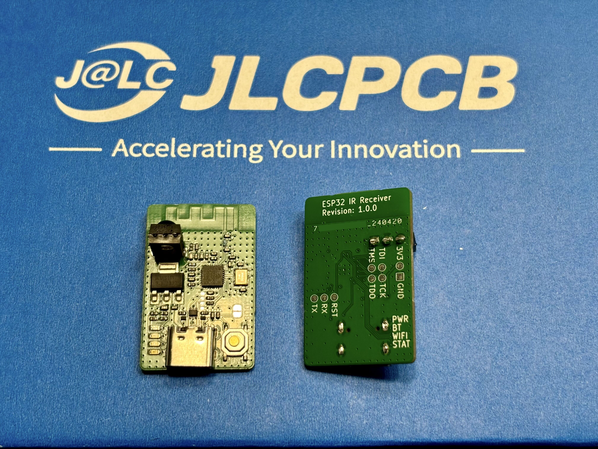
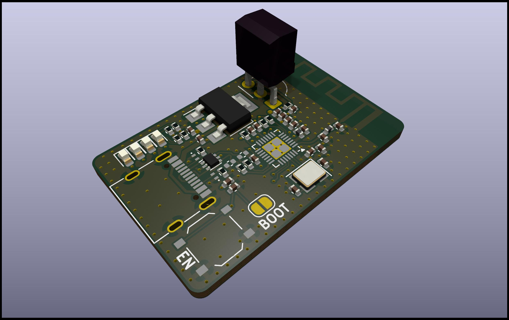
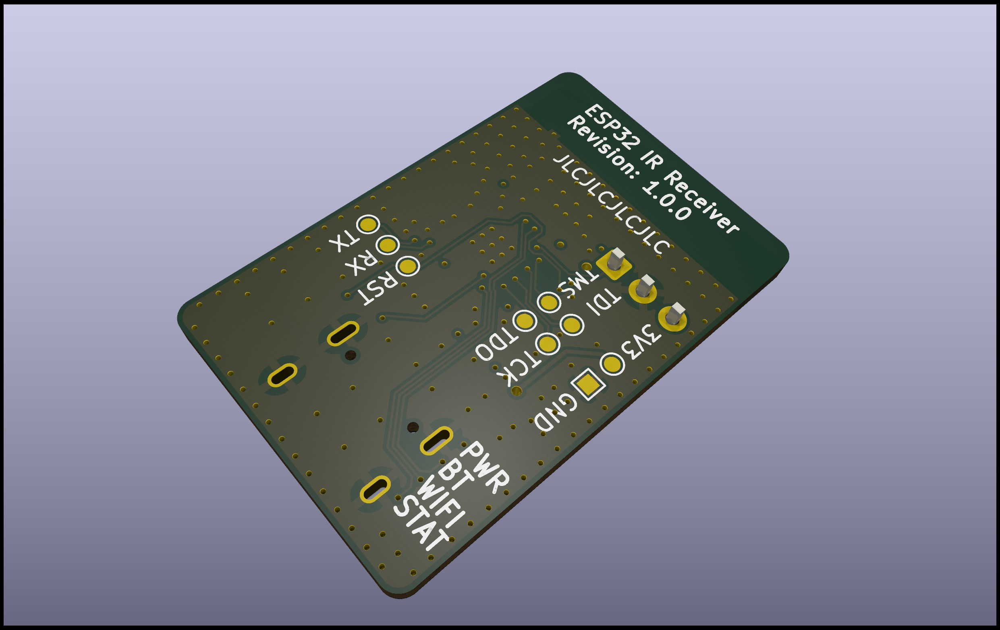

# ESP32 Infra-Red Receiver

This project is made to receive IR transmitter information (TV remote) and
control something over WiFi. This project will be used for
[UPnP remote controller project](https://github.com/valletw/esp-upnp-remote).

## Hardware

Four status LED are available:

- `PWR`: 3.3V state
- `BT`: Bluetooth / BLE pairing status
- `WIFI`: WiFi connection status
- `STAT`: Software protocol status

Two buttons are available:

- `BOOT`: Control processor download mode on boot
- `EN`: Control processor reset

For advanced debug, test points are available for JTAG probe and UART controller.

*Note: 3D shapes were not fully configured on my setup, so some components are not
displayed in the render, to be fix.*

### Components choice

This project is based on an ESP32-C3 SoC: `ESP8685H4` (4 MB Flash with no
PSRAM). ESP32 has been selected for the WiFi & Bluetooth support and the big
community to generate easily a software. The choice of "C3" is to ensure support
with the SDK for longer time and minimal footprint. ESP32 modules have not been
kept due to PCB assembly fees. Espressif hardware design rules has been take into
account following there
[documentation](https://docs.espressif.com/projects/esp-hardware-design-guidelines/en/latest/esp32c3/pcb-layout-design.html)

USB-UART bridge has not been added to reduce the number of component. The ESP32
support direct USB connection to manage debug mode with firmware download, and
UART communication.

The 3.3V to power all the components is generated from an LDO using the 5V of the
USB socket.

All others components has been selected from [JLCPCB](https://jlcpcb.com/parts/)
catalogue to minimize the cost and the assembly fees.

### Manufacturing

The board is manufactured by [JLCPCB](https://jlcpcb.com), here is the details
you will require to generate an order.

*Note: JLCPCB requests some modifications on output files, do not use direct
export from KiCad (check the FAQ)*

#### PCB

Files: [Gerbers](jlcpcb/gerbers.zip)

Configuration              | Value
---------------------------|---------------------------------
Base Materiel              | FR-4
Layers                     | 4
Dimensions                 | 33.14 x 21.45
Different design           | 1
Delivery format            | Single PCB
PCB thickness              | 1.6
PCB color                  | Green (other colors have fees)
Silkscreen                 | White
Materiel type              | FR4-Standard TG 135-140
Surface finish             | HASL
Specify layer sequence     | F_Cu / In1_Cu / In2_Cu / B_Cu
Impedance control          | Yes
Layer stack-up             | JLC04161H-7628
Via covering               | Tented or Plugged
Min via hole size/diameter | 0.3mm/0.4mm
Remove order number        | Specify a location

*Note: All options have not been detail here, keep default value.*

#### Assembly

Files: [BOM](jlcpcb/bom.csv), [CPL](jlcpcb/cpl.csv)

Configuration       | Value
--------------------|--------------------
PCBA type           | Economic
Assembly side       | Top
Tooling holes       | Added by JLCPCB

Verify "pick & place" orientations and positions on the web viewer

JLCPCB will add 2 tooling holes for assembly (1 mm diameter near the board corners).

*Note: All options have not been detail here, keep default value.*

### ESP32 Pinout

For those who want to reuse this project, here is the ESP32 pinout to manage the
different input/output.

Name              | Pin  | Direction
------------------|------|----------
IR Rx             | IO3  | Input
WiFi status       | IO0  | Output
Bluetooth status  | IO1  | Output
Software status   | IO10 | Output
